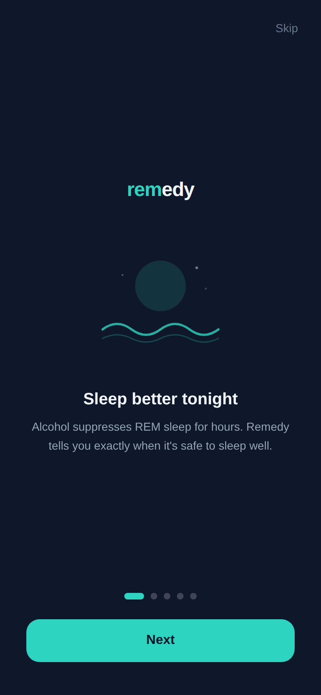
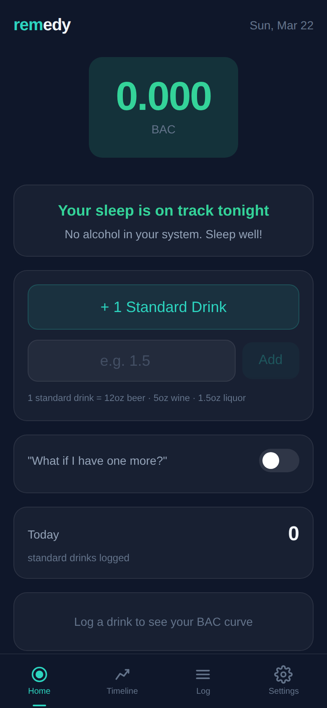
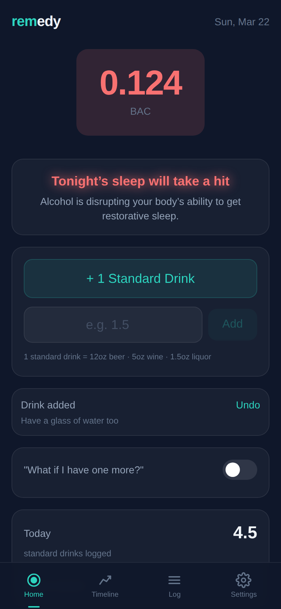
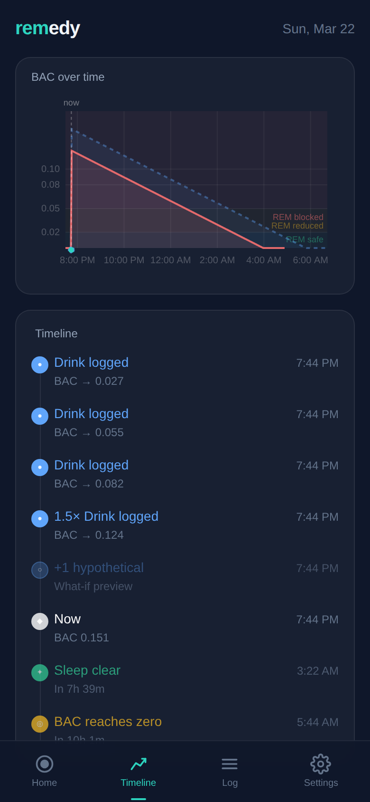

# **rem**edy

Track your drinks. Protect your REM sleep.

**remedy** is a mobile-first PWA that logs alcoholic drinks and shows you in real time how they affect your sleep. It calculates your BAC, estimates how much REM sleep you'll lose, and tells you when it's safe to sleep without impact.

<p align="center">
  
  
  
  
</p>

## Disclaimer

**Remedy is for informational and educational purposes only.** BAC calculations are approximate estimates based on the Widmark formula and do not account for all individual factors (food intake, medications, hydration, liver health, tolerance, or genetic variation).

**This app should never be used to determine whether it is safe to drive, operate machinery, or make safety-critical decisions.** Always err on the side of caution. When in doubt, don't drive.

If you are concerned about your alcohol consumption, please consult a healthcare professional or contact [SAMHSA's National Helpline](https://www.samhsa.gov/find-help/national-helpline) at 1-800-662-4357 (free, confidential, 24/7).

## What it does

- **Log drinks** with one tap (standard) or custom amounts (e.g. 1.5 standard drinks)
- **Real-time BAC** calculated using the Widmark formula, updating every second
- **REM-safe countdown** — how long until alcohol clears enough for normal REM sleep
- **REM impact estimate** — minutes of REM lost and percentage reduction if you sleep now
- **"What if I have one more?"** — toggle hypothetical drinks to see projected impact
- **BAC curve chart** with color-coded REM zones (safe / reduced / blocked)
- **Timeline** of drink events, BAC milestones, and projected sober/REM-safe times
- **Undo** last drink within 5 seconds

## The science

BAC is estimated using the **Widmark formula**, the standard in forensic toxicology. Alcohol elimination is modeled as zero-order (constant rate of ~0.015 g/dL/hr).

REM impact is based on the **Gardiner et al. 2024** meta-analysis of 27 studies: each g/kg of alcohol reduces REM sleep by approximately 40 minutes. The REM-safe threshold adds a 1-hour buffer after BAC reaches zero for sleep architecture to normalize.

Sources: Ebrahim et al. 2013, Colrain et al. 2014, Gardiner et al. 2024, Ohayon et al. 2004.

## Run locally

```
npm install
npm run dev
```

## Deploy

Configured for Cloudflare Pages:

```
npm run deploy
```

## Tech

React 19, TypeScript, Vite 8, Tailwind CSS v4. No chart library — the BAC curve is drawn on canvas. All data stays in localStorage.
